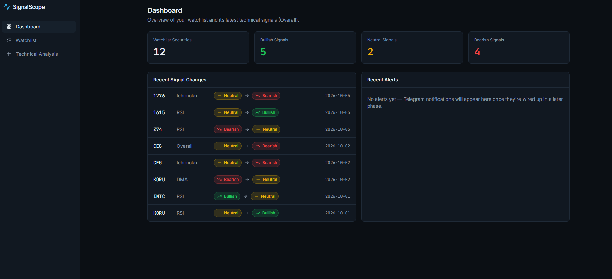
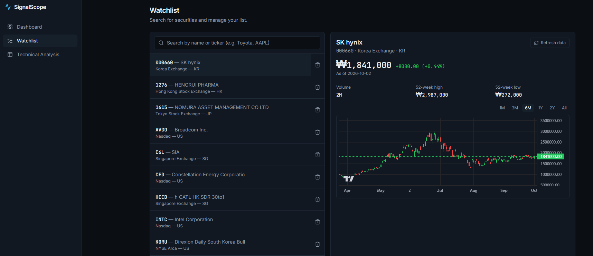

# SignalScope

Technical-analysis dashboard and alert platform for equities and ETFs across
seven markets: **US, Singapore, Hong Kong, China, Japan, South Korea and Taiwan**.

**Live app:** https://signalscope-tawny.vercel.app
**API:** https://signalscope-usxt.onrender.com


> Technical signals are generated algorithmically for informational purposes
> and do not constitute investment advice.

## Screenshots

**Dashboard** — watchlist overview, signal counts, and a feed of recent signal changes.



**Watchlist** — search and add securities across any of the 7 supported markets,
with a price chart and current signal detail per security.



## Features

- **Watchlist management** — search any equity/ETF across the 7 supported
  markets, add or remove it, and view its price history on an interactive
  candlestick chart.
- **Four independent technical signals** — Dual Moving Average (DMA), RSI,
  Ichimoku Cloud, and Elliott Wave, each computed per security and classified
  as Bullish / Neutral / Bearish.
- **Configurable-weighted Overall signal** — the four indicators are combined
  into a single transparent "Overall" signal using adjustable weights, so the
  logic isn't a black box.
- **Signal history** — every time a signal flips state, it's recorded, and
  recent changes surface on the dashboard.
- **Automated refresh twice a day** — a scheduled job re-pulls price data,
  recomputes all signals, and sends a Telegram notification whenever a
  signal changes.
- **Admin-protected writes** — endpoints that mutate the watchlist or trigger
  a refresh require an admin key (`X-Admin-Key` header).

## Architecture

```
┌────────────────┐      HTTPS       ┌─────────────────┐      SQL       ┌────────────────┐
│  Next.js web    │ ───────────────▶│   FastAPI API    │──────────────▶│ Neon Postgres  │
│  (Vercel)       │◀─────────────── │   (Render)       │◀────────────── │                │
└────────────────┘                  └─────────────────┘                └────────────────┘
                                              │
                                              │ yfinance
                                              ▼
                                     ┌─────────────────┐
                                     │  Yahoo Finance   │
                                     └─────────────────┘

┌──────────────────────────────┐
│ GitHub Actions                │   twice daily, 06:00 & 21:30 SGT
│ scheduled-refresh.yml         │──────────────────────────────────▶ calls admin-protected
│  • refresh price bars         │                                    API endpoints
│  • recompute all signals      │
│  • record signal_events       │
│  • Telegram alert on change   │
└──────────────────────────────┘
```

## Tech stack

**Frontend** — Next.js 16, React 19, TypeScript, Tailwind CSS v4,
[lightweight-charts](https://github.com/tradingview/lightweight-charts) for
price charts, deployed on Vercel.

**Backend** — Python 3.12, FastAPI, Pydantic v2, SQLAlchemy 2.0. Tested with
pytest/pytest-cov (93% coverage), type-checked with mypy (strict), linted and
formatted with ruff. Deployed on Render.

**Database** — Neon (serverless Postgres).

**Market data** — Yahoo Finance, via the `yfinance` library.

**Notifications** — Telegram Bot API.

**CI/CD** — GitHub Actions: lint + typecheck + test on every push, plus a
separate scheduled workflow for the twice-daily signal refresh.

## Project structure

```
signalscope/
├── api/                        FastAPI backend (Python 3.12)
├── web/                        Next.js frontend (TypeScript)
├── spikes/                     Early prototyping/exploration from project kickoff
├── docs/screenshots/           Images used in this README
└── .github/workflows/
    ├── ci.yml                  Lint, typecheck, test on every push
    └── scheduled-refresh.yml   Twice-daily refresh + signal recompute + Telegram alerts
```

## Getting started

**Prerequisites:** Python 3.12+, Node 20+, a Postgres database (the
[Neon](https://neon.tech) free tier works well), and optionally a Telegram
bot token if you want alert notifications locally.

### Backend

```
cd api
python -m venv .venv
.venv\Scripts\activate
pip install -e ".[dev]"
```

Create `api/.env`:

```
DATABASE_URL=postgresql://...
ADMIN_API_KEY=choose-a-password
ALLOWED_ORIGINS=http://localhost:3000
TELEGRAM_BOT_TOKEN=
TELEGRAM_CHAT_ID=
```

(`TELEGRAM_BOT_TOKEN`/`TELEGRAM_CHAT_ID` can be left blank — notifications are
simply skipped if they're not set.)

Run the API:

```
uvicorn signalscope.api.main:app --reload
```

The API is now at `http://localhost:8000`.

### Frontend

```
cd web
npm install
```

Create `web/.env.local`:

```
NEXT_PUBLIC_API_URL=http://localhost:8000
```

Run the frontend:

```
npm run dev
```

The app is now at `http://localhost:3000`.

### Running tests

```
cd api
ruff format .
mypy src --no-incremental
pytest --cov=signalscope --cov-report=term-missing
```

A few tests hit the real Yahoo Finance API and are skipped by default. To run
them too:

```
$env:SIGNALSCOPE_NETWORK_TESTS="1"
pytest
```

## Deployment

- **API** — Render (free tier), at https://signalscope-usxt.onrender.com
- **Frontend** — Vercel (free tier), at https://signalscope-tawny.vercel.app
- **Database** — Neon (free tier, serverless Postgres)
- CORS is locked to the Vercel origin via `ALLOWED_ORIGINS`
- The scheduled refresh job authenticates to the API using `ADMIN_API_KEY`

## Known limitations

- **Cold starts** — the Render free tier spins the API down after inactivity,
  so the first request after a period of idle time can take 30-60s.
- **Yahoo Finance is unofficial** — `yfinance` has no SLA; data can lag, and
  the integration could break if Yahoo changes its page structure.
- **Elliott Wave is inherently subjective** — wave-counting is more
  interpretive than DMA/RSI/Ichimoku; treat it as directional, not precise.
- **Signal weights aren't backtested** — the weights behind the "Overall"
  signal are manually configured, not statistically validated against
  historical performance.
- **Telegram alerts aren't shown in-app yet** — notifications are sent
  successfully, but the dashboard's "Recent Alerts" panel doesn't surface
  them yet (planned for a later phase).
- **No user accounts** — the watchlist is global/shared, protected only by a
  single admin key for write access, not per-user.

## Possible future work

- Surface Telegram alert history in the dashboard's "Recent Alerts" panel
- Backtesting framework to validate and tune signal weights
- Per-user accounts and watchlists
- Additional indicators and markets

---

`spikes/` holds early prototyping and exploration from the start of the
project, before the current architecture was settled.